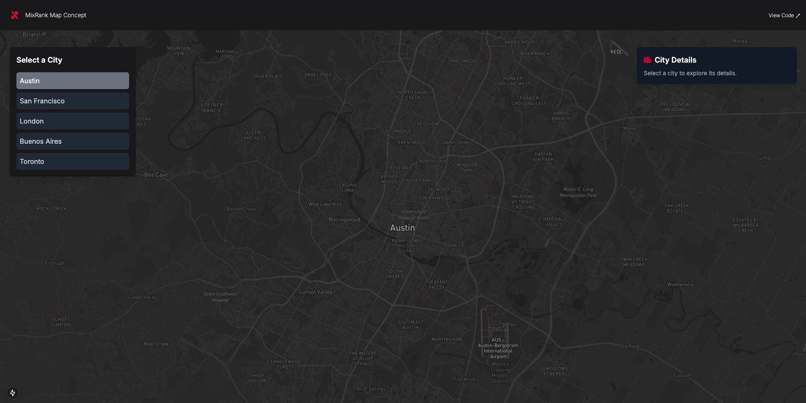
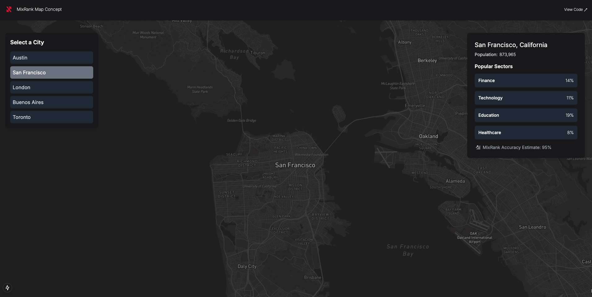

## MixRank Map Concept

This app allows users view popular sectors in a city. 

The data is not accurate, but it demonstrates how MixRank could create interesting front-end displays in the future.

Link: [Live Demo](https://mixrank-concept.onrender.com/)  

> Note: Please allow up to 30 seconds for the site to load - it's hosted for free. 

---

## Functionality

### 1. **Landing Page**  
Click on a city to view industry data.

### 2. **View Data**  
View popular sectors in that city.

## Housekeeping

The data in the project is not vetted for accuracy. 